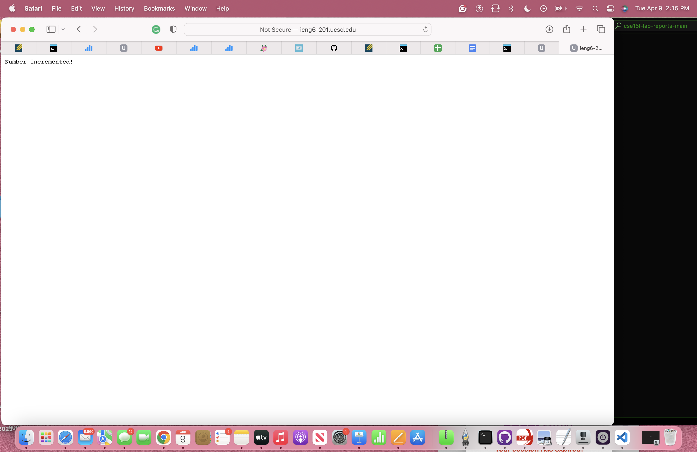
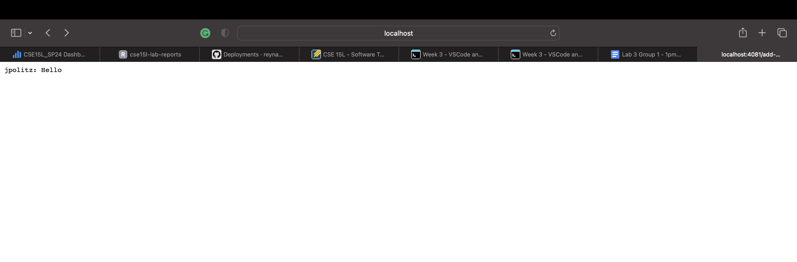

## Part1

- Which methods in your code are called? 
ChatServer.main(String[] args), Server.start(int port, URLHandler handler), Handler.handleRequest(URI url)
- What are the relevant arguments to those methods, and the values of any relevant fields of the class?
ChatServer.main(String[] args)- args, Server.start(int port, URLHandler handler)- port, handler(chat), Handler.handleRequest(URI url)-url
- How do the values of any relevant fields of the class change from this specific request? If no values got changed, explain why.
Chat in the handler class updates to the new chat message <username>: <message>\n.

- Which methods in your code are called? 
ChatServer.main(String[] args), Server.start(int port, URLHandler handler), Handler.handleRequest(URI url)

- What are the relevant arguments to those methods, and the values of any relevant fields of the class?
ChatServer.main(String[] args)- args, Server.start(int port, URLHandler handler)- port, handler(chat), Handler.handleRequest(URI url)-url

- How do the values of any relevant fields of the class change from this specific request? If no values got changed, explain why.
After   /add-message?s=How%20are%20you&user=yash, the chat field in the Handler class updates from "jpolitz: Hello\n" to "jpolitz: Hello\nyash: How are you\n".

## Part 2 

## Part 3
In week 2 and week 3, I learned about URLs and servers. I learned how to make and edit a URL by adding things to the end of the URL with paths and queries. 
