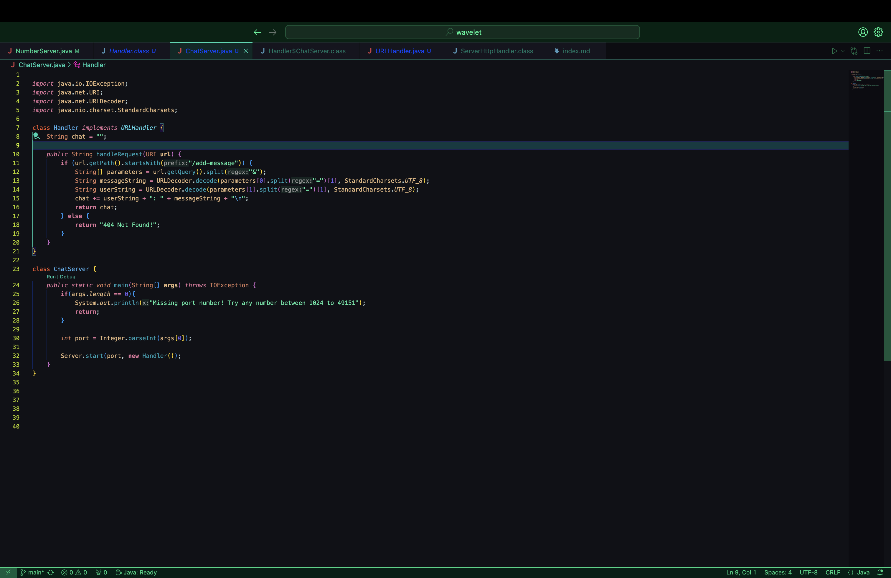

## Part1

- Which methods in your code are called? 
`ChatServer.main(String[] args)`, `Server.start(int port, URLHandler handler)`, `Handler.handleRequest(URI URL)`

- What are the relevant arguments to those methods, and the values of any relevant fields of the class?
`ChatServer.main(String[] args)`- `args`(value of 4000) `Server.start(int port, URLHandler handler)`- `port`(4000), `handler`(`chat`), `Handler.handleRequest(URI url)`- `url`(`http://localhost:4000/add-message?s=Hello&user=jpolitz`)

- How do the values of any relevant fields of the class change from this specific request? If no values got changed, explain why.
After the request of the URL provided above, the `chat` field in the Handler class updates from "" to "jpolitz: Hello\n." In other words, the class updates to the new chat message `<username>: <message>\n`.

- Which methods in your code are called? 
`ChatServer.main(String[] args)`, `Server.start(int port, URLHandler handler)`, `Handler.handleRequest(URI url)`

- What are the relevant arguments to those methods, and the values of any relevant fields of the class?
`ChatServer.main(String[] args)`- `args` (which contains the port number 4000), `Server.start(int port, URLHandler handler)`- `port` (4000), `handler` (an instance of `Handler` class where `chat` field is initially ""), `Handler.handleRequest(URI url)`- `url` (`http://localhost:4000/add-message?s=How%20are%20you&user=yash`)

- How do the values of any relevant fields of the class change from this specific request? If no values got changed, explain why.
After the request of the URL `http://localhost:4000/add-message?s=How%20are%20you&user=yash`, the `chat` field in the `Handler` class updates from "jpolitz: Hello\n" to "jpolitz: Hello\nyash: How are you\n". This is because the `handleRequest(URI url)` method parses the URL, extracts the message ("How are you") and the user ("yash"), and appends them to the `chat` field in the format `<username>: <message>\n`.

## Part 2 

1. Run `ls` with the absolute path to the private key for your SSH key for logging into ieng6

2. Run `ls` with the absolute path to the public key for your SSH key for logging into ieng6
 

3. Log into your ieng6 account without being asked for a password
   

## Part 3
In week 2 and week 3, I learned about URLs and servers. I learned how to make and edit a URL by adding things to the end of the URL with paths and queries. 
